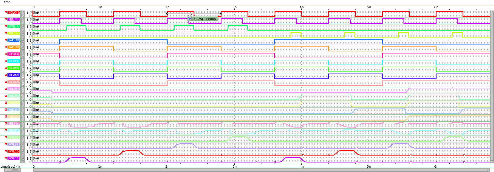

# Design-6T-SRAM-16x8
Digital Circuit Design Course Project  
Authors:  
Doan Dang Quang  
Le Minh Hung

## SRAM Simulation Result

## Reference

[1] Y. Alekhya and J. Sudhakar, “Design Analysis of SRAM Cell with Improved 
Noise Margin based on Aspect Ratio Adjustments,” 2017, doi: 
10.29042/2018-2645-2650. 
[2] N. H. E. Weste and D. M. Harris, CMOS VLSI Design: A Circuits and Systems 
Perspective, 4th ed., Boston, MA, USA: Addison-Wesley, 2010. 
[3] D. Dutt, P. Mittal, B. Rawat, and B. Kumar, “Design and Performance Analysis of 
High-Performance Low Power Voltage Mode Sense Amplifier for Static RAM,” 

https://github.com/gautam19499/6T-SRAM_cell_design.git
